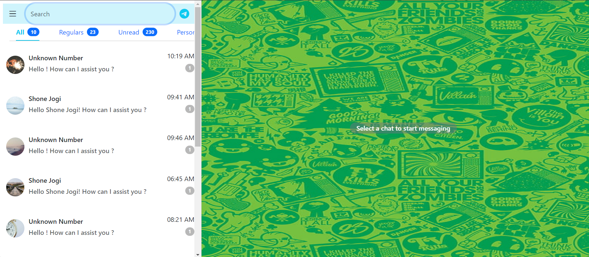
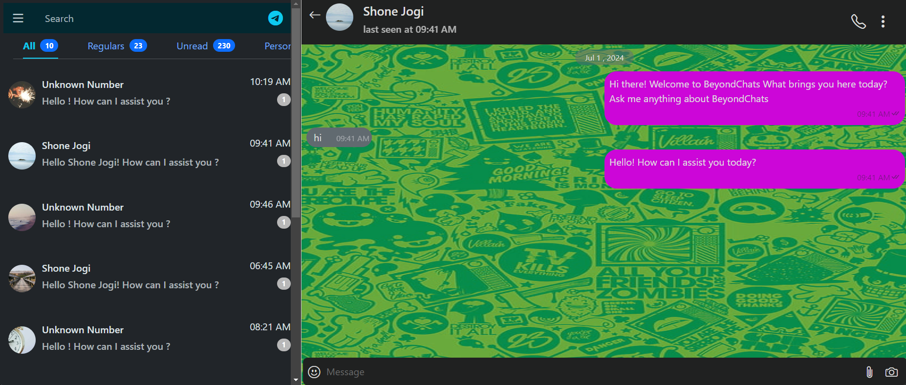

# Telegram UI Replica

This project is a replica of the Telegram user interface built using React, React Router, and various custom components and hooks. The application is designed to be responsive and provides a chat interface similar to Telegram.

## Table of Contents

- [Features](#features)
- [Technologies Used](#technologies-used)
- [Installation](#installation)
- [Usage](#usage)
- [Project Structure](#project-structure)

## Features

- Responsive UI that adapts to different screen sizes.
- Chat interface with a list of chats and chat messages.
- Navigation between chat lists and individual chat messages.
- Infinite scrolling for chat messages.
- Light and dark theme support.

## Technologies Used

- React
- React Router
- Bootstrap
- Custom Hooks
- Context API

## Installation

1. Clone the repository:

   ```bash
   git clone https://github.com/Deepak931014/BeyondChtas-Assignment.git
   cd telegram-ui-replica
   ```

2. Install dependencies:

   ```bash
   npm install
   ```

3. Start the development server:

   ```bash
   npm start
   ```

## Usage

Once the development server is started, you can open your browser and navigate to `http://localhost:5173` to see the application in action.

### Screenshots

#### Light Mode



#### Dark Mode



## Project Structure

```bash
telegram-ui-replica/
│
├── public/
│   ├── index.html
│   └── ...
├── src/
│   ├── components/
│   │   ├── ChatHeader.jsx
│   │   ├── Chats.jsx
│   │   ├── ChatMessages.jsx
│   │   ├── InputBox.jsx
│   │   ├── NavTabs.jsx
│   │   ├── NoChatSelected.jsx
│   │   ├── Shimmer.jsx
│   │   └── IndividualShimmer.jsx
│   ├── context/
│   │   └── ThemeContext.jsx
│   ├── hooks/
│   │   ├── useFetchChats.js
│   │   └── useFetchProfile.js
│   ├── App.jsx
│   ├── index.js
│   └── ...
├── .gitignore
├── package.json
├── README.md
└── ...
```
